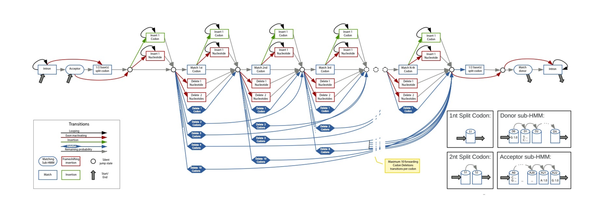

# CESAR3.0

Reimplementation of the [CESAR2.0](https://github.com/hillerlab/CESAR2.0) HMM based exon realigner.
[Scientific publication](https://academic.oup.com/bioinformatics/article/33/24/3985/4095639) Sharma et. al.

Downsides of the 2.0 version:

- enormous RAM consumption on long transcripts (can easily consume up to 1Tb)
- single-threaded

The goal of this project is to create a CESAR2.0 alternative which is more memory-efficient and runs in parallel.

**Supplementary figure 1.**

The Hidden Markov Model consists of states that emit the upstream and downstream intronic bases,
the splice sites, and the exon body. The exon body consists of states that match entire codons
with emission probabilities reflecting the similarity to the codon in the reference exon,
states that emit partial codons that represent frameshifting deletions, states that insert any
of the 61 nonstop codons, and nucleotide insertion states that insert in-frame stop codons
or insert frameshifts. Codon deletions are modeled by transitions that skip between 1 and 10 codon
units (blue transitions). The non-emitting (silent) black circle states allow deleting more than 10
successive codons. All transitions representing exon-inactivating mutations (splice site mutations
or frameshifting indels) are shown in red, transitions to codon insertion states are green,
and transitions that loop in insert states are black. The grey transitions are not free parameters
but are fixed by the constraint that the sum of all outgoing transition probabilities of a state must be 1.

